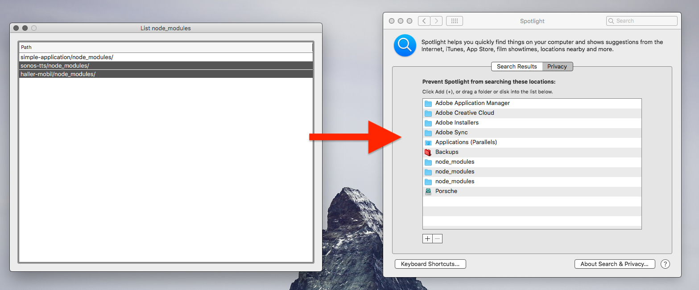

#  List node_modules

macOS app which lists `node_modules` folder so you can drag and drop them into Spotlight Privacy.
Finally no more `node_modules` in the search results

## Questions
How do you set the inital directory of the NSOpenPanel to the users home folder, if you cannot get the home folder because of the sandbox? 
https://stackoverflow.com/a/10955994/279890 https://stackoverflow.com/a/9553507/279890 

-> temporary entitlements  for `com.apple.security.temporary-exception.files.home-relative-path.read-only`
-> use `char *realHome = getpwuid(getuid())->pw_dir;` see realHomeDir
-> `NSString *realHomeDir = [NSString stringWithFormat@"/Users/%@",NSUserName()];`

## Material
* [Using Objective-C Lightweight Generics](https://useyourloaf.com/blog/using-objective-c-lightweight-generics/)

